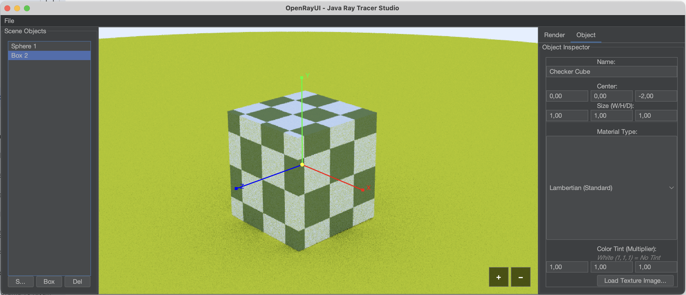

# OpenRayUI - Java Ray Tracing Studio

   

**OpenRayUI** is a Physically Based (PBR) Ray Tracing engine developed from scratch in Java, featuring a modern graphical user interface (GUI) designed to control the engine in real-time.

This project simulates complex light-matter interactions while providing the user with an interactive environment to edit the scene. Inspired by Peter Shirley's *"Ray Tracing in One Weekend"* series, it extends the core concepts with advanced features such as **BVH Optimization**, **Texture Mapping**, **Multithreading**, and a comprehensive **Editor UI**.

---

## 🌟 Features

### 🎨 Render Engine
* **Physically Based Materials:** Support for Lambertian (Matte), Metal (Reflective), and Dielectric (Glass/Water) materials.
* **Texture Mapping:** Apply image textures (.png, .jpg) or procedural patterns (Checkerboard) to objects.
* **Geometry Support:** Primitives including Spheres and Axis-Aligned Bounding Boxes (AABB).
* **Anti-Aliasing (AA):** Multi-sample anti-aliasing (MSAA) for smooth edges.
* **Gamma Correction:** Gamma 2.0 implementation for realistic color output.

### ⚡ Performance & Optimization
* **BVH (Bounding Volume Hierarchy):** Acceleration structure reducing scene traversal complexity from $O(n)$ to $O(\log n)$.
* **Multithreaded Render Loop:** Background rendering threads ensure the UI remains responsive without freezing.
* **Russian Roulette Optimization:** Statistically terminates ray bounces early to optimize performance without sacrificing physical accuracy.
* **Preview Mode:** Automatically lowers resolution and sampling during camera movement for a fluid editing experience.

### 🖥️ User Interface (UI)
* **Modern Design:** Professional Dark Theme using the FlatLaf library.
* **Gizmo Controls:** Select, move (X, Y, Z axes), and scale objects directly within the 3D scene using mouse interactions.
* **Object Inspector:** Real-time property editor to modify materials, colors, and dimensions of the selected object.
* **Scene Management:** Outliner panel to manage the list of objects in the scene.
* **Project Management:** Save scene states to files (.ray) and reload them using Java Serialization.
* **Image Export:** Save the final rendered output as a PNG file.

---

## 🛠️ Architecture & Design Patterns

The project adheres to **Clean Code** principles and robust **Object-Oriented Programming (OOP)** practices to ensure maintainability and scalability.

* **MVC (Model-View-Controller):** The codebase is strictly organized into `model` (Scene data), `ui` (View components), and `controllers` (Camera/Gizmo logic) packages to separate concerns.
* **Singleton Pattern:** Utilized in `Scene` and `RenderSettings` classes to provide a **Single Source of Truth** for the scene state and render configurations across the application.
* **Strategy Pattern:** Implemented via `Material` and `Texture` interfaces. This allows different shading behaviors (e.g., *Metal* vs *Lambertian*) or texturing algorithms to be swapped dynamically at runtime without altering the object's geometry code.
* **Composite Pattern:** The `HittableList` and `BVHNode` classes allow individual objects (like Spheres) and groups of objects to be treated uniformly, simplifying the recursive ray intersection logic.
* **Observer-like Callbacks:** The UI communicates with the Render Engine using decoupled `Runnable` callbacks, ensuring the interface remains responsive and loosely coupled from the heavy computation logic.

---

## 📸 Screenshots

| **Main Studio UI** | **Object Inspector & Gizmo** |
| :---: | :---: |
|  |  |
| *Real-time viewport with Outliner and Settings* | *Interactive editing with PBR Material controls* |

### High Quality Output

*Final render example with Global Illumination and Reflections.*

---

## 🚀 Installation & Build

Java JDK 24 or higher is required to run this project.

### 1. Clone the Repository
	git clone [https://github.com/yourusername/OpenRayUI.git](https://github.com/yourusername/OpenRayUI.git)
	cd OpenRayUI

### 2. Build With Maven
	mvn clean install

### 3. Run the Application
	java -cp target/classes:target/dependency/* com.taha.openrayui.App

---

## 🎮 Controls

### Camera Navigation
* **Left Click + Drag (Empty Space):** Orbit camera around the target point.
* **Right Click + Drag:** Pan the camera view (Trucking).
* **Mouse Wheel:** Zoom In / Out.

### Object Manipulation (Gizmo)
* **Left Click (On Object):** Selects the object and reveals the Gizmo tool.
* **Gizmo Arrows (Red/Green/Blue):** Click and drag an arrow to **move** the object along the X, Y, or Z axis.
* **Gizmo Center (Yellow Box):** Click and drag the center pivot to **scale** the object uniformly.

---

## 🔮 Future Goals (Roadmap)

To further enhance the capability and performance of OpenRayUI, the following features are planned for future updates:

* [ ] **Parallel Stream Processing:** Implementing Java's `Stream API` (parallel()) to utilize all CPU cores more efficiently during the rendering loop.
* [ ] **Mesh Import Support:** Adding a parser for `.obj` files to render complex 3D models (Triangle Mesh) beyond simple primitives.
* [ ] **Advanced Lighting:** Implementing Emissive Materials (Area Lights) for more realistic scene lighting.
* [ ] **GPU Acceleration:** Investigating integration with OpenCL or CUDA to offload heavy vector calculations to the Graphics Card.

---

## 👨‍💻 Contact

**Developer:** Yusuf Taha Akyol
**Email:** yusuftahaakyol2868@gmail.com
**LinkedIn:** www.linkedin.com/in/yusuf-taha-akyol-7429ba319
